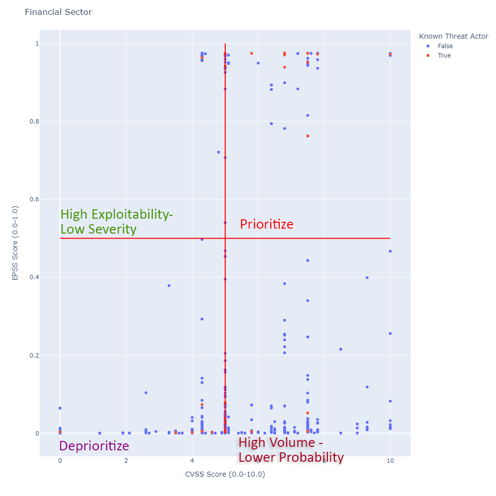

# SecurityScorecard CVE Exploit Prediction Scoring System PoC

This notebook will generate a chart based on the CVEs found for a given portfolio.

It maps the CVEs CVSS score against the Exploit Prediction Scoring System (EPSS) and also highlights whether or not that particular CVE has been known to be used by Threat Actors (TAs)

This can be handy to identify which CVEs should be considered a priority and also which CVEs may be utilized by attackers in future campaigns. 

For more information on EPSS see ["EPSS Model"](https://www.first.org/epss/model)

